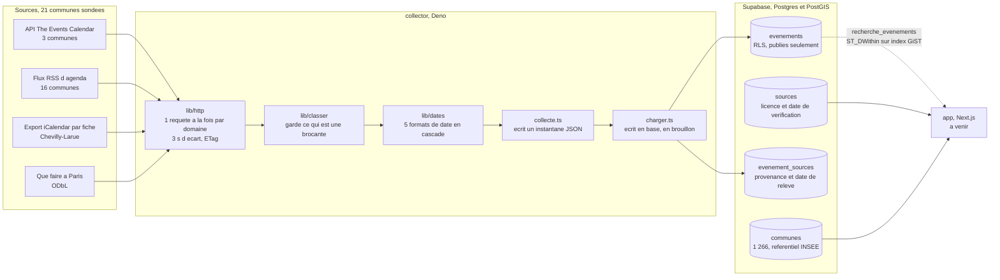

# brocantes

Recense les brocantes et vide-greniers autour de chez vous, en Val-de-Marne et
a Paris. Une seule question, une reponse en moins de cinq secondes : qu'est-ce
qu'il y a ce week-end a moins de vingt kilometres, et comment j'y vais.

Etat au 11/09/2026 : jalon 1 livre, la chaine de collecte tourne et ecrit du
reel. **11 evenements en base**, issus de 4 sources, sur 21 communes sondees.
L'interface n'existe pas encore.

## Ce qu'il faut savoir avant de lire le code

**Il n'existe pas de source ouverte de brocantes en Ile-de-France.** C'est le
fait central du projet, et il a ete mesure, pas suppose. DATAtourisme porte une
categorie dediee aux vide-greniers, remplie en Occitanie avec 168 entrees, et
vide en Ile-de-France sur les 10 670 points d'interet de son export regional.
La recherche nationale sur data.gouv.fr ne rend aucun jeu de donnees. Les
portails departementaux du 92, 93, 94, 91, 77, 78 et 95 n'en portent aucun. Le
detail des mesures est dans [docs/SOURCES.md](docs/SOURCES.md).

**Les deux agregateurs prives du secteur sont fermes.** Leurs conditions
interdisent textuellement de "copier ou aspirer" leur contenu, et la Cour de
cassation a tranche contre le reutilisateur le 15 octobre 2025 dans un cas tres
proche. Ce depot ne les touche pas.

**La donnee vient donc des mairies elles-memes.** Un agenda municipal publie est
une information publique au sens de l'article L321-1 du code des relations entre
le public et l'administration, librement reutilisable. Les clauses de mentions
legales que presque toutes les communes affichent ne sont pas des licences
homologuees au sens de l'article L323-2, et sont donc sans effet sur ce droit.
Les obligations reelles tiennent en trois points, appliques ici : ne pas alterer
l'information, ne pas la denaturer, citer la source et la date du dernier
releve.

## Architecture



Le collecteur ne parle jamais au site, et le site ne parle jamais aux mairies.
Les deux ne partagent que le schema. La collecte n'a besoin d'aucun droit
d'ecriture, ce qui la rend rejouable sans secret.

## Sources branchees

| Famille | Communes | Ce qu'elle lit |
|---|---|---|
| `tribe` | Valenton, La Queue-en-Brie, Noiseau | API JSON du plugin The Events Calendar. La source la plus propre : dates structurees, adresse, code postal. |
| `rss` | 16 communes du 94 | Flux RSS. Cinq encodages de date differents, d'ou la cascade de `lib/dates.ts`. |
| `ics-wp` | Chevilly-Larue | Pas de flux global, mais un export iCalendar par fiche. |
| `opendata-paris` | Paris | Jeu "Que faire a Paris", ODbL, mis a jour quotidiennement. |

## Installation

```bash
cp .env.example .env.local          # puis remplir
deno check collector/collecte.ts    # verification des types
```

Le referentiel des communes se charge une fois, depuis `geo.api.gouv.fr`, en une
requete par departement. Jamais commune par commune : 1 266 requetes pour un
fichier qui se telecharge d'un bloc serait un gaspillage et une impolitesse.

## Commandes

```bash
# Collecte complete. Les domaines sont listes un par un : un domaine absent est
# un domaine inaccessible, ce qui a deja evite deux redirections non prevues.
deno run --allow-net=<domaines> --allow-read --allow-write collector/collecte.ts

# Rejouer une seule source, pour corriger un collecteur sans resolliciter
# les vingt autres sites.
deno run --allow-net=<domaine> --allow-read --allow-write \
  collector/collecte.ts --source=cachan-rss

# Charger en base. Tout arrive en brouillon, rien n'est publie automatiquement.
deno run --allow-net --allow-env --allow-read collector/charger.ts <fichier.json>

# Garde RLS : verifie ce que la cle publique peut reellement atteindre.
deno run --allow-net=<hote> --allow-env tests/rls.ts
```

## La garde RLS

`tests/rls.ts` interroge l'API exactement comme le ferait un visiteur curieux,
et echoue si une table qui doit rester fermee repond quoi que ce soit. Sept
controles : lecture d'un evenement publie, non-fuite d'un brouillon, fermeture
des tables `contributions` et `alertes` qui portent des donnees personnelles,
refus d'une ecriture anonyme, absence de brouillon dans la fonction publiee,
bornage du rayon et de la limite.

Deux temoins vivent en base sous le prefixe `zzz-controle`, dates en 2099 pour
ne jamais croiser une recherche reelle. Sans eux, "la table ne renvoie rien"
passerait au vert sur une table vide, ce qui ne prouverait rien.

La garde a ete vue en rouge : en ouvrant volontairement deux politiques, elle
signale trois echecs et sort en code 1.

## Ce que le projet ne fait pas

Pas de collecte sur brocabrac ni vide-greniers.org. Pas de publication
automatique : un evenement dont la date a ete deduite plutot que declaree peut
envoyer quelqu'un devant une salle fermee. Pas de page de commune sans source
branchee : generer 1 266 pages dont 1 245 vides serait mauvais pour le
referencement et malhonnete pour le lecteur.

## Suite

Jalon 2, l'interface : recherche par position ou code postal, liste et carte
synchronisees, fiche evenement. Jalon 3, pages de commune et referencement.
Jalon 4, declaration par les organisateurs, moderation, alerte hebdomadaire.
Jalon 5, mentions legales et politique de confidentialite, avec passage par
l'agent juridique avant toute mise en ligne.
